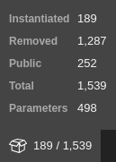
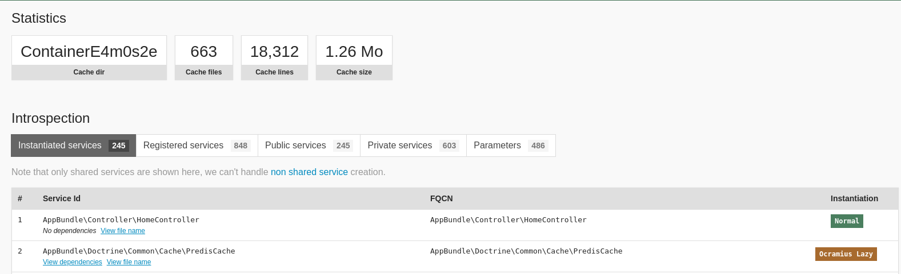

[](https://github.com/steevanb/symfony-container-introspection/tree/1.1.1)
[](https://php.net)


symfony-container-introspection
===============================

It helps you to know which services are instanciated, removed, public and list container parameters.

You have access to Container cache statistics: files count, count code lines and cache size.

With Symfony, a new profiler tab will appear:





[Changelog](changelog.md)

If you want to use it with `symfony/dependency-injection ^3.4`, use [steevanb/symfony-container-introspection ^1.0](https://github.com/steevanb/symfony-container-introspection/tree/1.0.x).

If you want to use it with `symfony/dependency-injection ^4.0`, use [steevanb/symfony-container-introspection ^1.1](https://github.com/steevanb/symfony-container-introspection/tree/1.1.x).

Installation
============

```bash
composer require --dev steevanb/symfony-container-introspection ^2.0
```

If you use Symfony (and not just `symfony/dependency-injection`), you can add `ContainerIntrospectionBundle` to your Kernel:
```php
# config/bundles.php
<?php

return [
    Steevanb\ContainerIntrospection\Bridge\ContainerIntrospectionBundle\ContainerIntrospectionBundle::class => ['dev' => true]
];
```
